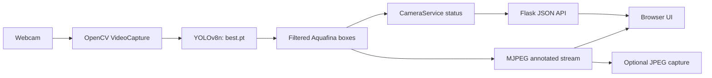
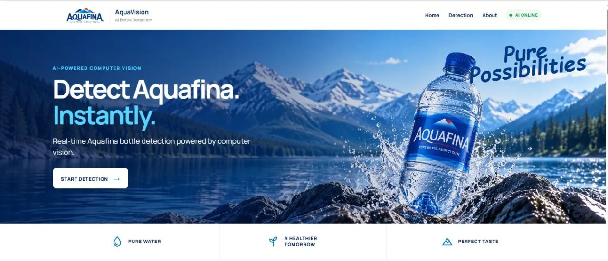
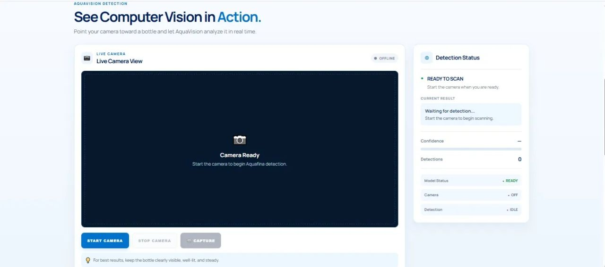
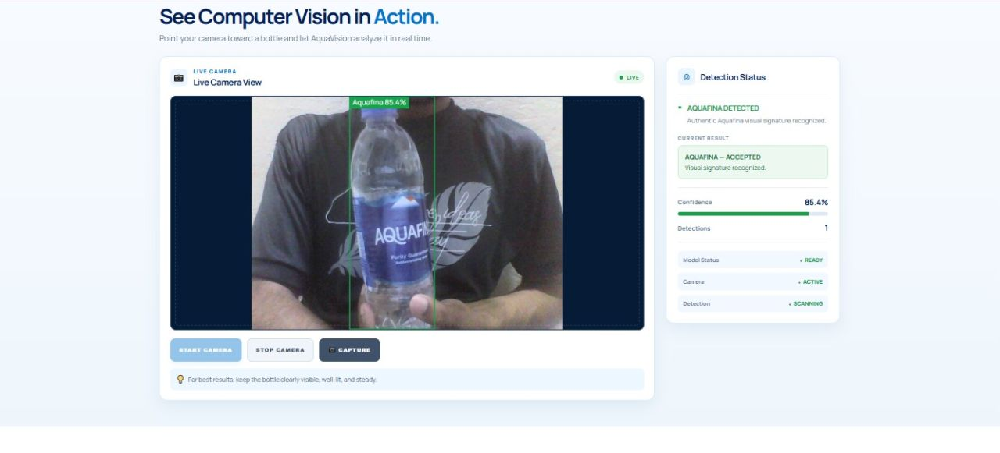
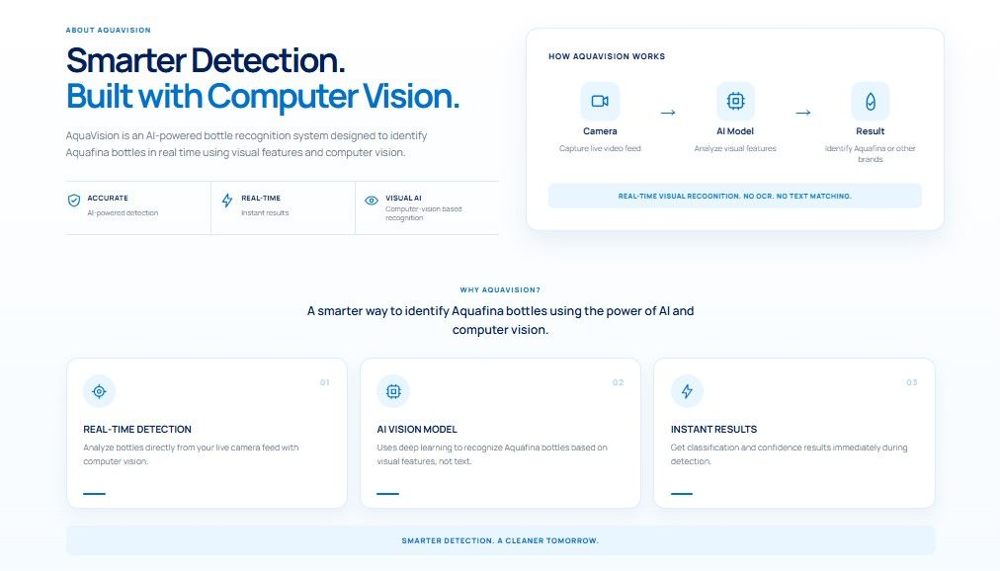

# AquaVision

Real-time, single-class visual detection of Aquafina bottles, delivered through a local Flask webcam application backed by a trained Ultralytics YOLOv8n model.

## At a Glance

| | Verified project fact |
| --- | --- |
| **Problem** | Determine whether an Aquafina bottle is present in a live camera frame without building an OCR/text-matching pipeline. |
| **Built** | A one-class YOLOv8n object-detection service, OpenCV webcam pipeline, Flask/MJPEG API, browser UI, saved-frame capture, and hardware-independent Pytest coverage. |
| **ML concepts** | Object localization, confidence thresholding, validation detection metrics, training augmentation, deterministic-run settings, and shortcut-learning limitations. |
| **Evidence** | The committed checkpoint stores validation precision **0.98971**, recall **0.98780**, mAP@50 **0.99476**, and mAP@50-95 **0.80400**; the repository also includes a real live-inference screenshot and **4 passing** application/service tests. |
| **Run locally** | `python -m pip install -r requirements.txt` then `python app.py`; open `http://127.0.0.1:5000`. See [Installation](#installation). |

> The metrics are checkpoint metadata for an unavailable validation split, not test-set results. The repository includes inference/deployment code and the trained checkpoint, but not the original dataset or training scripts.

## Overview

AquaVision addresses a product-recognition problem: determine whether an Aquafina bottle is present in a camera frame and surface that decision in real time. The deployed artifact is an object detector, not an OCR pipeline: it predicts bounding boxes for its sole learned class, **`Aquafina`**. The web application loads the model once, runs inference on webcam frames, overlays qualifying detections, and exposes their confidence in the UI.

The project goal is visually grounded recognition of the product in a scene. In the checked-in deployment, the operational decision is binary: a qualifying `Aquafina` detection is accepted; the absence of one is treated as a non-accept decision. It does **not** identify which alternative brand is present.

## Why This Project?

Packaging recognition is more demanding than matching a word. A detector must localize an object and can draw on the bottle’s overall visual presentation—such as shape, color layout, cap, label design, and context—rather than requiring a readable word at one fixed position. That also makes it important to test for shortcuts: a strong detection score alone does not show which visual cues the model relied on.

## Key Features

- Ultralytics YOLOv8n object detector packaged in `best.pt`
- One deployed class: `Aquafina`
- Real-time OpenCV webcam capture and annotated MJPEG stream
- Flask API for camera start/stop, status, and capture
- Configurable application detection threshold of `0.75`
- Browser UI showing model state, camera state, detection count, and highest confidence
- Timestamped annotated-frame capture to `captures/`
- Four automated application/service tests that run without a physical camera

## Dataset

The dataset itself is **not included** in the repository. There is no `data.yaml`, image directory, label directory, manifest, or dataset report to inspect. Consequently, the following commonly requested facts cannot be verified from the current checkout:

| Dataset question | Evidence in this repository |
| --- | --- |
| Source image count (including an approximate 600-image claim) | Not available |
| Aquafina / Kinley / Nestlé Pure Life source classes | Not available |
| Binary `Aquafina` / `Other` construction | Not represented in the deployed checkpoint |
| Train / validation / test image counts or split membership | Not available |
| Duplicate detection, near-duplicate audit, or exclusions | Not available |

What can be verified is the **deployed class mapping** stored in `best.pt`:

| Class ID | Label |
| ---: | --- |
| 0 | `Aquafina` |

This is a one-class detector (`nc: 1`), not a two-class classifier. A missing detection is therefore not evidence that a frame contains a particular competing brand; it only means no Aquafina box met the active confidence threshold.

## Dataset Preparation Pipeline

No dataset-preparation, splitting, deduplication, or auditing scripts are tracked in this repository, so the full data-engineering process is not reproducible from this checkout. The checkpoint records `seed: 0` and `deterministic: true` in its training arguments. Those settings make the recorded training run deterministic where supported, but they do not establish that dataset collection, duplicate handling, or split construction was deterministic.

For a reproducible training release, version the source manifest, labels, `data.yaml`, split seed and split lists, duplicate/near-duplicate audit output, and a preparation script alongside the model.

## Model

`best.pt` is an Ultralytics **YOLOv8n** detection checkpoint, initialized from `yolov8n.pt`. Its embedded model YAML records three detection strides (8, 16, and 32), one class, and approximately **3,011,043 parameters**. The checkpoint was written by Ultralytics `8.4.143`.

The committed model file is 6.25 MB. Its SHA-256 is:

```text
14793AC735D8D4F157FF810C6972A490894C1AF8D2B2908911FCEA236EA95A51
```

## Training Pipeline

Training code and the original dataset configuration are not committed. The following configuration is recovered directly from the checkpoint metadata; it is a record of the saved run, not a replacement for a reproducible training script.

| Setting | Recorded value |
| --- | --- |
| Task / base model | Detection / `yolov8n.pt` |
| Epochs | 150 |
| Image size | 640 |
| Batch size | 8 |
| Seed | 0 |
| Deterministic mode | `true` |
| Optimizer selection | `auto` |
| Initial / final LR factor | 0.01 / 0.01 |
| Patience | 50 |
| Augmentations | HSV H/S/V; translate 0.1; scale 0.5; horizontal flip 0.5; mosaic 0.5; erasing 0.4; mosaic close at epoch 20 |

The recorded data argument points to `/content/aquafina/data.yaml`, which is not present here. There is therefore no exact, runnable repository command for retraining. With the missing `data.yaml` and dataset restored, the checkpoint metadata corresponds to this command shape:

```powershell
yolo detect train model=yolov8n.pt data=<path-to-data.yaml> epochs=150 batch=8 imgsz=640 seed=0 deterministic=True patience=50
```

## Evaluation

The only evaluation values available are embedded in `best.pt` as validation detection metrics. They are not test-set results: the checkpoint records `split: val`, and no held-out test manifest or report is included.

| Validation metric | Value |
| --- | ---: |
| Precision (boxes) | 0.98971 |
| Recall (boxes) | 0.98780 |
| mAP@50 (boxes) | 0.99476 |
| mAP@50–95 (boxes) | 0.80400 |
| Validation box loss | 0.60800 |
| Validation classification loss | 0.43197 |
| Validation DFL loss | 1.02022 |

No confusion matrix, PR curve, per-image predictions, or evaluation-results image is tracked, so none is embedded here. These metrics should be interpreted as checkpoint metadata for an unavailable validation set, not as a claim about unseen competing brands or real-world deployment accuracy.

There is no tracked evaluation script or accessible validation/test dataset. The checkpoint metrics above can be inspected locally without changing the model:

```powershell
python -c "import torch; c=torch.load('best.pt', map_location='cpu', weights_only=False); print(c['train_metrics'])"
```

## Robustness & Shortcut-Learning Audit

No robustness report, transformed-image evaluation, label-proxy occlusion experiment, confidence-degradation analysis, or related source code is present in the repository. As a result, this checkout provides **no experimental evidence** for claims that the model ignores the printed “Aquafina” text, relies on any particular packaging cue, or has eliminated shortcut learning.

The recorded training configuration does include generic data augmentation (HSV color changes, translation, scaling, horizontal flips, mosaic, and erasing). These are training-time perturbations, not a documented robustness evaluation. They may broaden the visual variation seen during optimization, but without controlled measurements they do not quantify behavior under blur, lighting change, viewpoint shifts, text/label occlusion, or proxy-label masking.

To support the product-recognition objective, add a versioned robustness suite that reports baseline versus transformed confidence and detection rate for:

- illumination, blur, compression, scale, rotation, and partial-object occlusion;
- targeted masking of the wordmark/label region and matched non-label masks;
- Aquafina and non-Aquafina bottles photographed in comparable settings; and
- per-condition sample counts, confidence distributions, failures, and images.

Such experiments can show whether confidence degrades when a cue is removed and whether the model remains useful under a specified perturbation. They still would not, by themselves, prove that all shortcut learning has been eliminated.

## How It Works

```text
Webcam frame
  -> OpenCV VideoCapture
  -> YOLO prediction (`conf=0.75` in the Flask app)
  -> boxes labeled `Aquafina` + confidence
  -> highest confidence/status API
  -> UI: ACCEPTED when one or more boxes qualify
```

`services/detector.py` runs `model.predict` on each frame and draws the returned boxes. `services/camera_service.py` declares `aquafina_detected` true whenever its latest detection list is non-empty, and reports the maximum detection confidence. The browser renders **“AQUAFINA — ACCEPTED”** in that case. When no box qualifies, it displays a waiting/scanning state rather than a literal “REJECTED” label; operationally, that is the non-accept outcome.

There are two thresholds in the repository:

- Flask application: `0.75` (`config.py`)
- Standalone `webcam_detect.py`: `0.3`

The standalone script uses Ultralytics’ default plotted output, while the Flask app uses a custom blue box/label overlay. Keep this difference in mind when comparing demos.

## Architecture



## Demo / Screenshots

The following screenshots show the checked-in Flask interface in its ready, live-detection, landing, and product-overview states.

| Landing page | Camera ready |
| --- | --- |
|  |  |
| Live detection | Product overview |
|  |  |

The live example shows one UI-reported detection at 85.4% confidence. It is an illustrative runtime frame, not a validation metric or a robustness result.

## Tech Stack

- Python
- Ultralytics YOLO / PyTorch checkpoint
- OpenCV
- Flask
- HTML, CSS, and vanilla JavaScript
- Pytest

## Project Structure

```text
aquavision/
├── app.py                    # Flask routes and application factory
├── config.py                 # model path, camera index, threshold, host/port
├── best.pt                   # one-class YOLOv8n detector checkpoint
├── webcam_detect.py          # standalone OpenCV webcam runner
├── services/
│   ├── detector.py           # model loading, inference, box annotation
│   └── camera_service.py     # webcam lifecycle, status, saved captures
├── templates/index.html      # web interface
├── static/                   # CSS, browser logic, and existing visual assets
├── tests/test_app.py         # application and camera-service tests
└── captures/                 # runtime annotated JPEG output (gitignored)
```

## Installation

Windows PowerShell:

```powershell
cd C:\Users\Mueed Ahmed\Desktop\aquavision
python -m venv .venv
.\.venv\Scripts\Activate.ps1
python -m pip install --upgrade pip
python -m pip install -r requirements.txt
```

`best.pt` is committed at the repository root and is the expected model path. If it has been removed, restore the same checkpoint there before starting the application. The dependencies currently declared in `requirements.txt` are `flask`, `ultralytics`, and `opencv-python` (without version pins).

If PowerShell blocks activation, use this only for the current terminal session:

```powershell
Set-ExecutionPolicy -Scope Process -ExecutionPolicy Bypass
```

## Training

There is no tracked training entry point, dataset YAML, or source dataset, so no exact repository training command can be verified or run. See [Training Pipeline](#training-pipeline) for the configuration recovered from the checkpoint and the artifacts required to make retraining reproducible.

## Webcam / Application

Start the browser application:

```powershell
python app.py
```

Open `http://127.0.0.1:5000`, select **Start Camera**, and use **Capture** to save the latest annotated frame under `captures/`.

For the standalone OpenCV window (press `q` to exit):

```powershell
python webcam_detect.py
```

Both entry points use camera index `0`; update `CAMERA_INDEX` in `config.py` for a different device. The standalone script’s model path is relative to the current working directory.

## Testing

The test suite covers four behavior checks: home/status routes, camera start/stop with a fake capture device, project-relative model configuration, and creation of the capture directory. It does not test model accuracy, the physical webcam, dataset preparation, or robustness.

Verified in this workspace:

```powershell
python -m pytest -q --basetemp .tmp_pytest
# 4 passed
```

Using a repository-local base temp directory avoids a Windows temp-directory permission issue in this environment. In a normal environment, `python -m pytest -q` is the standard command.

## Results

The shipped artifact is a one-class Aquafina detector with the validation metrics recorded above and a runnable local webcam interface. No tracked evidence supports a benchmark against Kinley, Nestlé Pure Life, or any other “Other” class, and no robustness experiment is available to establish resistance to text/label shortcuts.

## Limitations

- Dataset provenance, size, source brands, split strategy, and duplicate audit are unavailable.
- The deployed model has no explicit `Other` class and cannot name a competing brand.
- The no-detection outcome is threshold-dependent; it is not a verified negative-brand classification.
- No test-set evaluation, confusion matrix, calibration analysis, or robustness/occlusion report is tracked.
- Requirements are unpinned, so future installs may resolve different dependency versions.
- Local webcam access and performance depend on the host camera, lighting, device, and installed runtime.

## Future Improvements

- Add versioned data manifests, preparation/split/audit scripts, and a documented licensing/provenance record.
- Evaluate explicit negative classes and publish test-set metrics, confusion matrices, PR curves, and error analysis.
- Add a controlled transformation and label-proxy occlusion suite with confidence-degradation reporting.
- Pin dependencies and add a reproducible training/evaluation environment.
- Add real annotated webcam screenshots and a short GIF captured from the deployed app.

## Contributors

Git history attributes the current application commit to **mueedahmed-7** and the model-addition commit to **Nehal Kashif**. This section reflects commit authorship only; no broader contributor roster is documented in the repository.

## License

No repository-level license file is present. The checkpoint metadata references the Ultralytics AGPL-3.0 license; that metadata does not establish a license for this repository, the dataset, or the trained weights. Add an explicit project license and confirm the applicable model/data licensing before redistribution.
